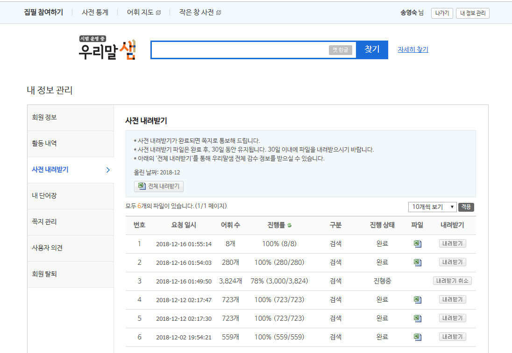

# 2018 서비스 되고 있는 사전들

작년 이맘때는 올해의 논문을 정리했었는데 올해는 다른 분들이 많이 하셔서 그대신 올해의 사전을 정리해서 공유할까 합니다.

먼저, "우리말샘"은 오픈형 사전으로 뜻풀이까지 다운로드 받을 수 있는 곳입니다. (다운 받을 때는 로그인 필수)

그 외의 사전들
----------------------------------
1. 한국수어사전

http://sldict.korean.go.kr/front/main/main.do

2. 아래 링크의 스케치 엔진 사전에서 "song"을 검색했더니 주어로 쓰였는지 서술어로 쓰였는지에 따라 관련어 정보와 예시 등을 보여줍니다. 부럽네요

https://skell.sketchengine.co.uk/run.cgi/wordsketch…

3. 영어 블로그 신어 사전

https://www.wordspy.com/

4. 영어 민간형 발음사전

https://forvo.com/

5. 영어 비속어사전

https://www.urbandictionary.com/

6. 그 외의 다양한 사전들(여러 언어에서).

https://www.onelook.com/?w=song&ls=a

http://www.memidex.com

https://www.lexicala.com/

# 사전과 이미지 캡션 그리고 클라우드 소스를 적절히 사용한 데이터 수집 "Teaching computers to see" 이 목적이라고 하네요. 

출처 : http://groups.csail.mit.edu/vision/TinyImages/

# 자주 쓰는 어휘 중에 벙어리 장갑 대신 엄지 장갑을 쓰자는 1인 운동 중입니다.
# 네이버에서도 오픈형 사전을 준비 중이라고 하네요
# 한국수어사전 찾기 편해지면 좋을 것 같아요
