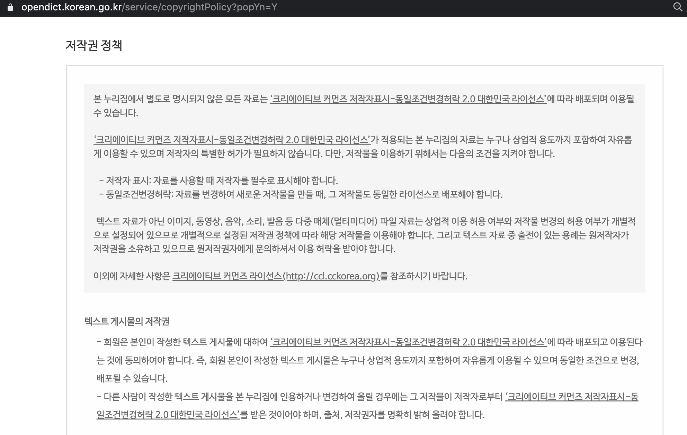
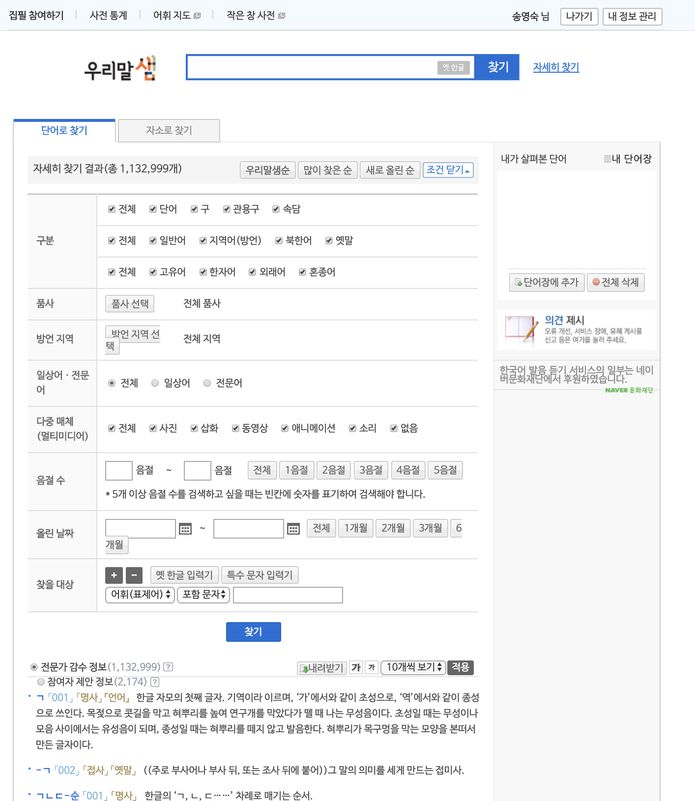
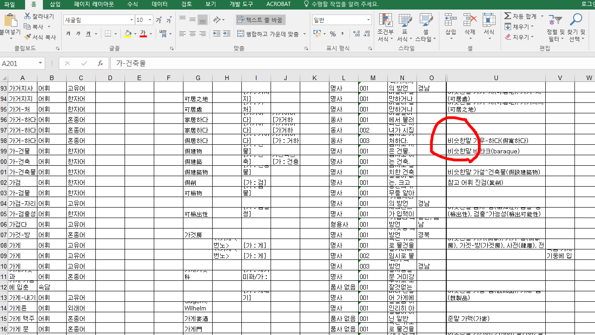
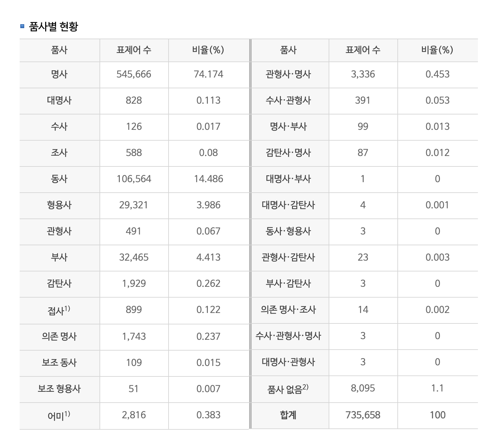

# 2018 서비스 되고 있는 사전들

"우리말샘"은 오픈형 사전으로 뜻풀이와 품사, 유의어 정보까지 다운로드 받을 수 있는 곳입니다.       

검색은 로그인 필요 없지만 다운 받을 때는 로그인 필수입니다.      

드물게 상업적 용도까지 허용하는 라이센스입니다. 그러나 영상등은 개별 라이센스가 적용되니 확인 필수!!    

   

다운로드 하는 방법은 부분적으로 받을 수도 있고 전체를 다운받을 수도 있습니다.   

물론 [API](https://opendict.korean.go.kr/service/openApiInfo)로도 받을 수 있습니다

엑셀로 다운로드 받으면 다음과 같이 정보를 볼 수 있습니다.

는 다음과 같습니다.

그 외의 사전들
----------------------------------
1. 한국수어사전

http://sldict.korean.go.kr/front/main/main.do

2. 아래 링크의 스케치 엔진 사전에서 "song"을 검색했더니 주어로 쓰였는지 서술어로 쓰였는지에 따라 관련어 정보와 예시 등을 보여줍니다. 부럽네요

https://skell.sketchengine.co.uk/run.cgi/wordsketch…

3. 영어 블로그 신어 사전

https://www.wordspy.com/

4. 영어 민간형 발음사전

https://forvo.com/

5. 영어 비속어사전

https://www.urbandictionary.com/

6. 그 외의 다양한 사전들(여러 언어에서).

https://www.onelook.com/?w=song&ls=a

http://www.memidex.com

https://www.lexicala.com/

## 사전과 이미지 캡션 그리고 클라우드 소싱을 적절히 사용한 데이터 수집              
"Teaching computers to see" 가 목적이라고 하네요.           

출처 : http://groups.csail.mit.edu/vision/TinyImages/

## 자주 쓰는 어휘 중에 벙어리 장갑 대신 엄지 장갑을 쓰자는 1인 운동 중입니다.
## 한국수어사전 찾기 편해지면 좋을 것 같아요
